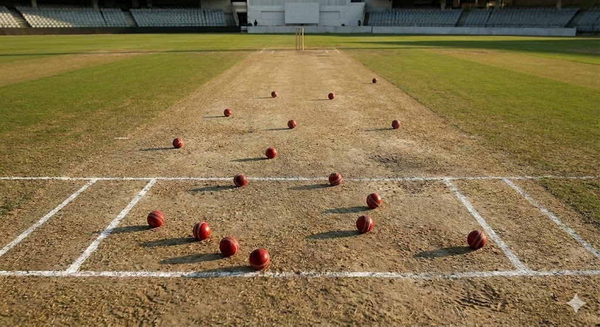

🏏 Cricket Ball Removal using YOLOv8 + LaMa Inpainting

A fully automated computer-vision pipeline that detects cricket balls in an image using YOLOv8 segmentation and removes them using LaMa inpainting.
This project cleans sports-analytics images by generating a natural, ball-free output.

📌 Project Overview

This repository provides:

🎯 Object detection (Cricket balls) using YOLOv8

🩹 Seamless object removal using LaMa inpainting

🖼️ Clean, natural-looking edited images

⚡ Completely automated inference pipeline

🛠️ Easy to integrate into sports analytics, training tools, and video pipelines

🚀 Tech Stack
Component	Technology
Detection	YOLOv8 (Ultralytics)
Inpainting	LaMa / Stable Diffusion
Language	Python
Libraries	OpenCV, NumPy, PyTorch

📸 Input vs Output

Input Image

Output Image

📂 Repository Structure
📦 cricket-ball-removal
 ┣ 📁 models
 ┣ 📁 results
 ┣ 📄 main.py
 ┣ 📄 requirements.txt
 ┣ 📄 README.md

⚙️ Installation
git clone https://github.com/your-username/cricket-ball-removal.git
cd cricket-ball-removal

pip install -r requirements.txt

▶️ Usage

Run the pipeline:

python main.py --input input.jpg --output output.png

🧠 How It Works

Load YOLOv8 segmentation model

Detect all cricket balls

Generate a binary mask

Apply LaMa inpainting on masked regions

Save the clean image

🏁 Results

Removes multiple objects accurately

Maintains pitch texture and lighting

Produces natural, artifact-free outputs

⭐ Future Improvements

Video support

Real-time pipeline

Custom training with cricket-specific datasets
